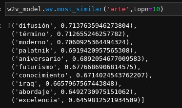
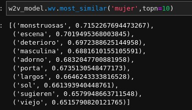
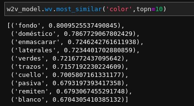
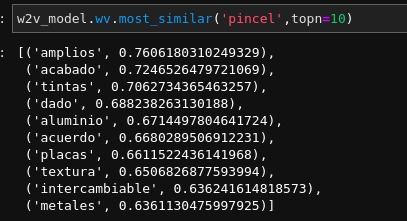

# Proceso de obtención del corpus:
Scraping de la coleccion digital del [Museo de Museo de Arte Latinoamericano
de Buenos Aires](https://coleccion.malba.org.ar/)

Al momento de realizar este práctico la colección cuenta con 569 obras, de las cuales 277 tienen alguna clase de texto que las describe

En scrapping_malba.py se encuentra el código utilizado para el scraping.

# Limpieza de los textos

Luego de explorar los datos un poco, fue notorio que había cosas que quedaban
del scraping, como por ejemplo algunas etiquetas html o de formato que hubo que limpiar:
- Eliminamos los números de las notas al pie, que son los números precedidos por puntos (.2 Blahblah)
- Reemplazamos \n3, \n, s\p por espacios

Luego de la limpieza de caracteres especiales, exploramos un poco más los datos y utilizamos nltk para separar el texto en oraciones. 
- Separamos en oraciones

Luego de explorar las oraciones vimos que para el dominio un largo de oración de 30 es un buen numero para deshacerse de oraciones poco significativas
- Nos deshacemos de oraciones muy cortas

Despues de separar en oraciones, eliminamos caracteres especiales, normalizamos a lowercase y ademas lemmatizamos utilizando el diccionario de lemas que está en este [repositorio](https://github.com/danibosch/word_clustering).

- Lowercase todo
- Nos deshacemos de caracteres especiales

# Vectorización de las palabras

Luego de la limpieza de los datos se aplicaron 3 estrategias para transformar palabras a vectores. 

- Wor2Vec
- Fasttext
- Triplas de dependencia

En todas las tecnicas utilizamos las oraciones como contexto de la palabra. Se podrían haber utilizado los textos completos quizás, pero se contó cada oración como un documento aparte.

Cosas a tener en cuenta del corpus:
- Cada texto se corresponde a la descripción de una obra de arte que puede ser de cualquier técnica; por lo cual es un corpus con bastante lenguaje técnico propio del dominio
- Además de descripciones de obras se incluyen breves biografías de los artistas, con muchas fechas, nombres propios y de lugares. Sería interesante ver qué sale de un análisis de entidades nombradas, dado que además son textos escritos *"correctamente"* (en el sentido de respetando las reglas gramaticales preestablecidas)
- La descripcón de las obras está realizada por expertos en el area y no es una descripción concreta a modo de caption, es decir, no se describen exactamente las imagenes si no que son más bien descripciones interpretativas. 
- Los textos si bien no son muy largos, están compuestos de oraciones muy largas de muchas palabras largas y "complicadas". 
- Es un corpus de 1M de palabras donde casi 30mil sonc únicas, es decir, no vamos a encontrar contextos muy diversos de usos de la mayoría de las palabras por lo cual las ténicas neuronales posiblemente den resultados muy atados a los textos particulares.

## Word2Vec

Se entrenó el embedding utilizando como documento cada oración del texto. Se probo con distintos tamaños de ventana y de vector para ver de que manera afectaba los resultados pero no hubo grandes diferencias en la calidad de los embeddings. 
Dada la diversidad de vocabulario, la poca cantidad de datos de entrenamiento y la especificidad de la mayoría de las palabras, no es sorpresivo que esta tecnica no de resultados super buenos.

Despues de probar con varias combinaciones de hiperparámetros, decidí usar una ventana grande porque muchas de las oraciones son largas y usan muchas palabras para expresar una misma idea, entonces trabajar con una ventana más grande me parecio apropiado. 
Los resultados que mostramos son para embeddings entrenados con una ventana de tamaño 7, vectores de 20 dimensiones (al ser un dominio tan específico, tener vectores muy grandes parece ser un desperdicio de capacidad de representar información), 5 ocurrencias minimas por palabra (para eliminar palabras demasiado específicas, dado que encima estamos usando las oraciones como documentos) y 200 iteraciones (epochs).
El vocabulario generado por el embedding contiene 4907 palabras, lo cual evidencia que la mayoría de las palabras se usan muy muy poco.

Algunos resultados interesantes y poco interesantes:

No se exploraron mucho los embeddings generados por word2vec ya que como las palabras no ocurren en contextos muy distintos es muy dificil que el embedding capture diversidad de contextos para las palabras.

## Fasttext

Se notan claras diferencias respecto a los vectores de word2vec. Los vectores generados por Fasstext son mucho más sensibles a la morfología de la palabra, ubicando cerca a palabras que se escriben parecido.

Utilizamos agglomerative clustering y los resultados bastante feos.

## Triplas de dependencia

Basado en el código de Dani Bosch, realizamos embeddings con triplas de dependencia. El plan es despues de realizar alguna tecnica de reduccion de dimensionalidad utilizar algun algoritmo como kmeans o los parecidos que usamos en los embeddings neuronales.

